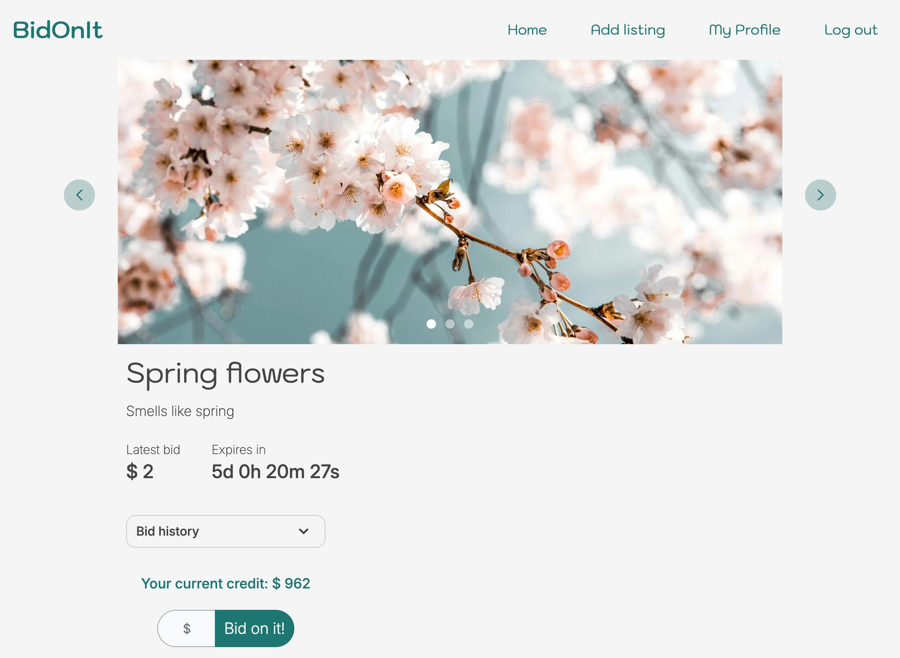

# Charlotte Valset - Semester Project 2

I am a front-end developer student at Noroff and a UX designer, please check out my Semester Project 2 assignment, an auction website - [BidOnIt](https://bidonit.netlify.app)

BidOnIt serves as an online auction marketplace, allowing users to list items for bidding and participate in auctions hosted by other users. Upon registration, users are granted with an initial credit balance of 1000, which can be used for placing bids or earned more through the sale of items. Access to bidding functionality is exclusive to registered users, while non-registered individuals can browse the available listings.

## The Process

I designed the user interface and wireframes using Figma, and subsequently developed a fully responsive website using Vite and Tailwind CSS. The website's functionality was implemented using vanilla JavaScript for a streamlined and efficient user experience.

## Built With

- Vite
- Tailwind
- Vanilla JS

## Getting Started

### Installing

## Contributing

If you'd like to get involved in the project, please consider one of the following options:

- Submit a Pull Request:
  If you've made modifications or enhancements to the codebase, it is encouraged that you initiate a pull request (PR).

- Report an Issue:
  Should you encounter an issue or have a feature request, don't hesitate to create an issue. Please describe the problem or the enhancement you have in mind in as much detail as possible. This will assist me in tracking and prioritizing community input.

## Contact

Please contact me through:

[My Portfolio page](https://charlottevalset-portfolio.netlify.app)

[My LinkedIn page](https://www.linkedin.com/in/charlotte-valset-6195b521a/)

## Acknowledgments

I would like to acknowledge my mentor, Eric Pretzinger - for guiding me and making me a better Front-End Developer, and also my fellow FED students at Noroff for helping me when I got stuck.
